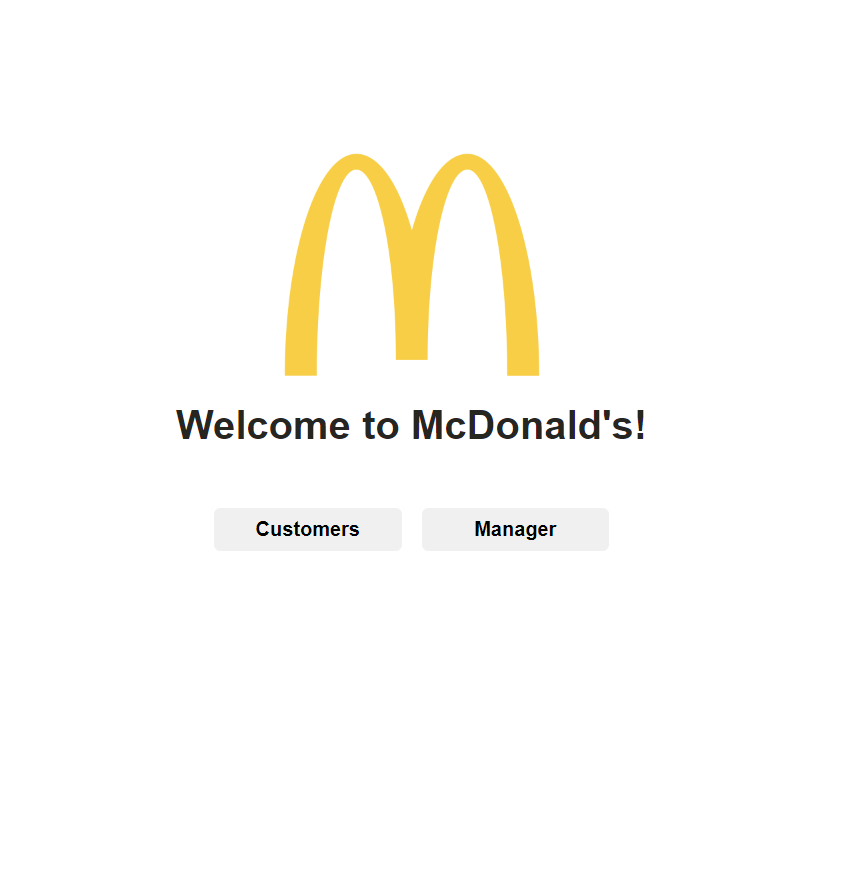
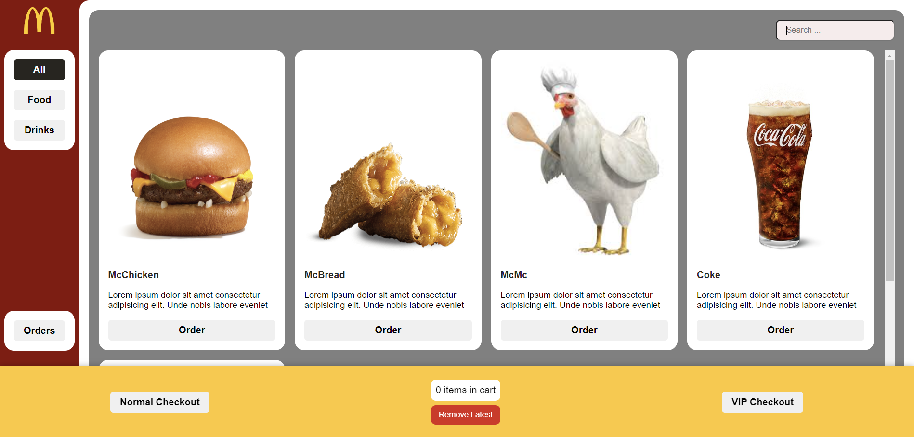
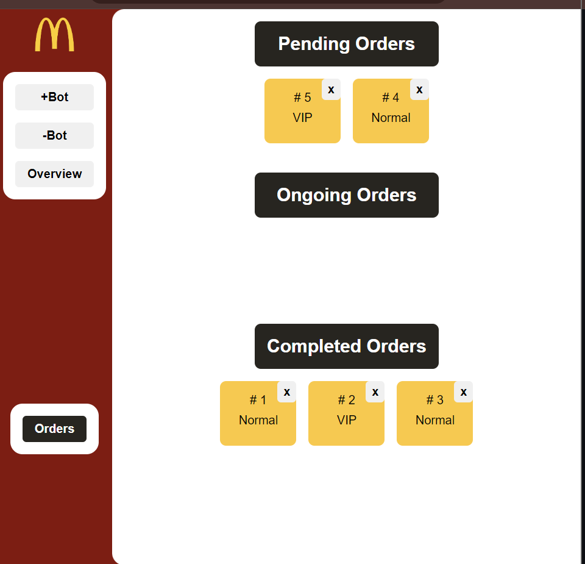

## McDonald's Bot Queue System

> Try the live [demo here](http://rxjs.ng-book.com)

## Quick start

```bash
# clone the repo
git clone https://github.com/DanielMcFluffy/se-take-home-assignment

# change into the repo directory
cd se-take-home-assignment

# install
npm install

# run
npm start
```

Then visit [http://localhost:4200](http://localhost:4200) in your browser.

### Screenshots

- Home Page

- Customers Page

- Managers Page


### Situation
McDonald is transforming their business during COVID-19. They wish to build the automated cooking bots to reduce workforce and increase their efficiency. As one of the software engineer in the project. You task is to create an order controller which handle the order control flow. 

### User Story
As below is part of the user story:
1. As McDonald's normal customer, after I submitted my order, I wish to see my order flow into "PENDING" area. After the cooking bot process my order, I want to see it flow into to "COMPLETE" area.
2. As McDonald's VIP member, after I submitted my order, I want my order being process first before all order by normal customer.  However if there's existing order from VIP member, my order should queue behind his/her order.
3. As McDonald's manager, I want to increase or decrease number of cooking bot available in my restaurant. When I increase a bot, it should immediately process any pending order. When I decrease a bot, the processing order should remain un-process.
4. As McDonald bot, it can only pickup and process 1 order at a time, each order required 10 seconds to complete process.

### Requirements
1. When "New Normal Order" clicked, a new order should show up "PENDING" Area. ✓ 
2. When "New VIP Order" clicked, a new order should show up in "PENDING" Area. It should place in-front of all existing "Normal" order but behind of all existing "VIP" order. ✓ 
3. The order number should be unique and increasing. ✓ 
4. When "+ Bot" clicked, a bot should be created and start processing the order inside "PENDING" area. after 10 seconds picking up the order, the order should move to "COMPLETE" area. Then the bot should start processing another order if there is any left in "PENDING" area. ✓
5. If there is no more order in the "PENDING" area, the bot should become IDLE until a new order come in. ✓
6. When "- Bot" clicked, the newest bot should be destroyed. If the bot is processing an order, it should also stop the process. The order now back to "PENDING" and ready to process by other bot. ✓
7. No data persistance is needed for this prototype, you may perform all the process inside memory. ✓ 

### Functioning Prototype
You may demostrate your final funtioning prototype with **one and only one** of the following method:
- CLI application
- UI application ✓
- E2E test case

### Tips on completing this task
- Testing, testing and testing. Make sure the prototype is functioning and meeting all the requirements.
- Do not over engineering. Try to scope your working hour within 3 hours (1 hour per day). You may document all the optimization or technology concern that you think good to bring in the solution. 
- Complete the implementation as clean as possible, clean code is a strong plus point, do not bring in all the fancy tech stuff. 
